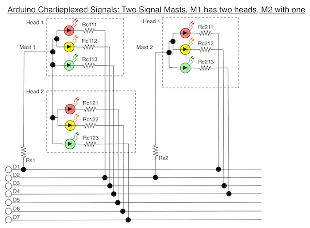
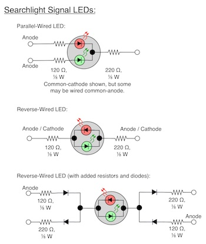

# linesideSignal-Library
---
Version a1 - initial version, March 2015

by Ken Shores

linesideSignal is a library defining classes and functions that allow an Arduino to act as a driver for LED-based lineside signals on a model railroad without additional multiplexing chips or other complex circuitry. All you need are signal masts using LEDs, and resistors.

		Warning: Only LED-based signals may be used. Bulbs of any size will draw enough current to damage the Arduino.

The library will work with any LED-based signal (within the defined maximum current per LED limits), including searchlight signals, normal multiple-lamp color signals, and both position and color-position signals.

It supports common anode, common cathode and separately-wired signals, including those using alternating current to produce yellow. It also supports flashing signals, both the kind used by lineside signals (all lights flash together) or those used by grade crossings (lamps alternate flashes). And you can select whether flashing lamps and those turned on and off will gradually change intensity or immediately go from dark to fully-lit, or vice versa. 

By default signals will be set up to use the gradual intensity change, but setRamp can be used to turn this off (or back on), and for grade-crossing flashers, turning it off is more prototypical.

Both memory and processing time will be more limiting than the number of available pins, unless you need a lot of pins for other uses. A practical limit is probably three or four three-head signals per Arduino (9 - 12 lit LEDs), although you could do more with only a moderate loss of intensity. 

Note: before using with signals described as using "high intensity" LEDs, or with white LEDs, or for scales larger than HO/OO verify that LED current requirements do not exceed 40 mA, otherwise permanent damage to the Arduino's anode pin connected to such a LED may result. Normal colored LEDs will have currents below 30 mA. Do *NOT* use with signals that use bulbs rather than LEDs as the high currents will almost certainly damage the Arduino.

Additionally, if you miswire LEDs such that more than one connects to the same anode and cathode, or omit or undersize a resistor, the resulting overcurrent condition may cause permanent damage to the Arduino's anode pin connected to that LED.  Omitting a resistor will likely also damage the LED inside the expensive signal. Double check all wiring before powering on the Arduino. And, of course, use this program at your own risk.

This library assumes a 16 MHz Arduino (most current models) and the typical set of analog and digital pins. 

The library supports direct driving of multiple LEDs through a technique known as "charlieplexing", see the Wiring section for an explanation of what this means for wiring up signals to the Arduino.

    This library is distributed in the hope that it will be useful, but WITHOUT ANY WARRANTY; without even the implied warranty of MERCHANTABILITY or FITNESS FOR A PARTICULAR PURPOSE.  
    
This code is released to the public domain.

## Overview:
----
The library defines signals in terms of a "mast" that contains one or more "heads", each consisting of one or more "lamps" (each lamp represents one LED, or a special paired LED used in a searchlight signal). 

Masts, heads and lamps are arbitrary, and are intended to reflect the physical structure of lineside signals. Some library routines make assumptions based on that structure (largely with regard to specifying activation by color).

Once defined, lamps may be individually turned on or off or set to flash, and more than one lamp per head may be lit simultaneously. A head with lamps of different colors can also be set to a specific color, which will turn on lamps of that color and make the others dark. It can also be set to "dark", turning all lamps associated with that head off.

Typically all flashing lamps will flash at the same time, but individual lamps can be set to flash in opposition to the usual period (useful for grade crossing flashers, for example). Finally, by default a lamp turning on, turning off, or flashing will not go fully on or off immediately, but will ramp up or down in intensity over about 3/10ths of a second (300 milliseconds). And flashing lamps will be off for only 1/10th of a second (100 milliseconds). You can disable this intensity ramp for individual lamps, causing flashing ones to be on for 5/10ths of a second and off for 5/10ths of a second. You can also change the interval from one second by changing the rate (the default rate of 60 flashes per minute equates to an interval of one second per flash).

The library supports any LED-based signal within the maximum current requirement of 40 milliAmps per anode/cathode pair imposed by the Arduino hardware. It can support signals wired common-anode, common-cathode, or where each LED is wired individually. Most commercially-available signals for N and HO scale use LEDs of 25 or 30 mA maximum current per LED. Some use significantly less. Note that signals using bulbs cannot be driven by an Arduino directly, due to current requirements for those.

Two types of speciality LEDs are also supported: one is actually a pair of LEDs in a single case, wired parallel to each other and reversed, so that voltage in one direction makes the LED green, in the other red, and quickly alternating produces an orangish yellow color. A second type has three wires: usually a cathode and two anodes. From a wiring perspective, it acts like two normal LEDs, but both are in the same housing, so lighting individual ones makes it red or green and lighting both makes it "yellow". Both kinds of LED could be used in "searchlight" type signals. See the Searchlight Signals section for information on how to configure these.

While it appears to a viewer that all lit lamps are always on, this is because of the persistence of vision. In reality, each is lit for a few hundred microseconds every few milliseconds, and no more than one LED is lit simultaneously. This allows individual LEDs up to the Arduino limit of 40 mA to be used, although to avoid risk of damage to the Arduino it is probably best to avoid LEDs requiring more than 30 mA (only high-intensity LEDs need more than that).

When turning lamps off and on, changes do not take effect immediately. Changes happen at set times during the interval based on the flash rate. All lamps set to go off will be turned off first, before any pending new lamps are turned on, and this can be up to one interval (one second by default) after the command to turn them off was given. And there may be an additional delay of up to one second before the new lamps are turned on. The gap is usually shorter when signals are set to ramp up and down in intensity. This means that you cannot use setLamp or other library routines to flash a signal at a predictable rate outside of using the built-in flashing attribute.

## How it Works:
---

Each time around loop() the library must be called to update the LEDs, and loop times must be fairly fast (less than the cycle time, preferably less than half the cycle time). A LED will be turned on by powering its anode (as an OUTPUT at HIGH, +5V) and setting its cathode to ground (OUTPUT LOW) while all other pins wired to signal LEDs are left in INPUT (high impedance) state. A pin used as the anode for one set of LEDs may also be a cathode for LEDs on other anodes. The only limitation is that any pair of pins can only be used for a single LED in the same polarity (i.e., an anode/cathode pair of pins must be unique to a single LED).

After the LED has been lit an appropriate interval, on a subsequent call its cathode will be turned off (set to INPUT), and if there are other lit LEDs on the same anode, the next of them will have its cathode set to ground. This repeats until all LEDs on that anode have had their turn, then the anode is turned off and the next anode with LEDs is activated along with the cathode of the first LED on that anode being grounded.  

When all anodes with LEDs have had their turn, the program returns to the first anode and begins over.  The complete cycle of all LEDs on all anodes being lit once should occur within the cycle time (which can be adjusted). This should be under 4.0 milliseconds (passed to the function as 4,000 microseconds). The default is somewhat faster than this, to improve appearance on video (which is more likely to pick up flickering in charlieplexed LEDs).

This library is written to work with a 16 MHz Arduino. Most current Arduinos operate at 16 MHz, except for some older designs based on the ATmega168 or later chips underclocked to 8 MHz. Note: while most Pro Mini Arduinos now use the 16 MHz ATmega328, some may still be available that use the older chip and some have been made using the 328 but at 8 MHz. Timing problems may result when using this library with 8 MHz Arduinos, causing visible flicker or other problems. The smaller SRAM on the older chips (1K instead of 2K) may also be problematic, depending on the number of signal lamps defined.

If you are uncertain what clock or memory your Arduino has, run the IDmyArduino sketch included with the library (in the Examples folder) and open the serial monitor window, and it will print a brief report including the clock speed and available SRAM (which is slightly less than the total because the sketch is using some of it).

## Wiring Signals:
---
Cautions:

1. Powering a LED without the proper minimum amount of resisistance will destroy the LED, rendering that expensive signal so much scrap metal. It may also destroy the anode pin on the Arduino due to over-current conditions. Double-check wiring and be sure there's a resistor on every wire before applying power. If in doubt about size, a total resistance per LED (the sum of the resistors on the common and a per-LED wire) of 1 kOhm (1,000 Ohms) is always going to be safe at Arduino voltages, although it may make LEDs a little dimmer than they need to be.

2. Connecting a bulb of any sort directly to an Arduino will exceed the rated current, and may (likely will) damage the Arduino, possibly rendering the pin used permanently non-functional. Be very sure you are using LEDs.

3. White signal lamps are problematic. Older ones may use bulbs even when the rest of the signal uses LEDs (ISS says on their website that their B&O signals are wired like this). Even when LEDs are used, white LEDs are often high-current, and may exceed Arduino limits, destroying the anode pin. If possible, use a multimeter to verify that current through any white LED is below 40 mA using a known good power source (and appropriate-size resistor) before wiring to an Arduino.

4. While not absolutely required, it is recommended that resistors be placed on both anode and cathode wires, and that the anode resistor be significantly smaller than the cathode. This will avoid leakage currents that could cause unlit LEDs to glow faintly. The total resistance needed for the LED is divided across the two as described below.

		Note: pin 13 should not be used for charliplexed LEDs as the built-in LED and resistor will cause problems with additional LEDs connected via that pin. The library does not allow pin 13 to be used as an anode or cathode. It's also probably a good idea to avoid using pins 0 & 1, since those are also used for the serial interface, which is probably needed for debugging your sketch; however as long as you aren't using the serial interface, they can be used.

Signals can be wired in more than one way, but usually to reduce the number of wires in the signal mast there is one shared (common) wire plus one wire per LED. The common can be either "common anode" or "common cathode". Common anode wiring has one wire for the positive voltage (the +5V anode) shared by all of the LEDs, plus one wire per LED that is connected to ground (the cathode). An alternative is common cathode, where the ground wire is shared and each LED has a positive wire. Different signal manufacturers use different methods, and some use both depending on the specific model of signal. Typically there is one common per signal mast, however some have one per head.

Common anode is slightly more typical and is described here. For common cathode, simply reverse positive and negative as described here when wiring, but in the routines below make sure the pin referenced as anode is still the one connected to the positive side of the signal and the one referenced as cathode is connected to the negative (ground) side.

If you are uncertain how to wire up a signal to an Arduino, experiment with some cheap LEDs (and resistors) from Radio Shack to become comfortable with the process, before wiring up a $30 signal mast to an Arduino. And remember, every wire to or from a LED should have a resistor when charlieplexing.

Arduinos use 5 Volt power. Tthere are also 3.3 Volt models, and those could be used with appropriate changes to resistor size, but the description here assumes the more common 5 Volt model. This means that resistance values calculated for LEDs need to assume a 5 Volt power supply, rather than the 12-16 Volts usually used to choose resistors for model railroad signals. And what that means is that any resistors supplied with a signal will be overly large for use with an Arduino, and need to be replaced.

If you know the details for the LEDs in your signals, the rules for chosing resistance per LED are the usual ones: use Ohm's Law (R = (Vs - Vf)/I) where Vs is the source voltage (5V), Vf is the LEDs "forward voltage" (typically 1.4 - 2.2 volts) and I is the current in Amp (typically 0.020). This gives numbers of 140 - 180 Ohms for typical LEDs. For charliplexing, divide that into two unequal portions and put the larger on the negative (or cathode) side of the LED. Remmber that typical resistors have 10% of error in their values, and always round up by more than 10%.

		Note: if in doubt, a total of 1 kOhm or more of resistance per LED should be safe with any LED-based signal used in HO scale or smaller signals (I have no experience with larger signals). A good way to archive this is with a 470 Ohm resistor on the shared common wire (assuming the usual common-anode wiring is used by the signal) and a 680 Ohm resistor on each individual LEDs cathode wire. Resistors can be 1/8 Watt or larger. For most LEDs this is very conservative. Using this much resistance will likely make the signal a little dimmer than it could be, but perhaps not enough to notice.

For maximum brightness a lower total resistance should be used. A resistance of 340 Ohms should be safe for any normal LED (some specialty LEDs require over 500 Ohms, but these are not likely to be used in signals). Most signals use normal LEDs and a total resistance of 340 Ohms will usually be a good choice. This level of resistance will be safe for normal or small LEDs (SMD LEDs) using 10 mA current (or more), although still somewhat conservative.

A good way to divide this is to use a 120 Ohm anode resistor and 220 Ohm cathode resistor for a total of 340 Ohms. 

Under no circumstances should two LEDs share a cathode resistor when wired common-anode (they will obviously share an anode resistor), or share an anode resistor when wired common-cathode. If two LEDs are to be lit simultaneously, wire them to separate pins on the Arduino and use setLamp to turn both on together or, if one pin is strongly desired, wire each LED with a resistor and then wire both of the resistors to the pin. But if you do that, be sure that maximum current from the pair will not exceep 40 mA (this is risky with most HO and N-scale signals as each LED may use more than 20 mA). Unless you are really certain, wire each LED separately to Arduino pins.

It is recommended that resistors be placed at the signal, and not at the Arduino, as this allows signal-specific resistor values to be used when multiple masts of differing design are wired to one Arduino.

The following example shows how two signal masts could be wired.

Mast 1 has two three-lED heads, and has its common anode wired to pin D1 (which can be any Arduino pin, digital or analog) and its cathodes wired to pins D2 to D7 (one per LED). Mast 2 has a single head, and it re-uses pin D2 as its common anode (it could use any pin other than D1 for this) and its cathodes to pins D1, D3 and D4 (any pins other than D2).

To light Mast2, Head 1 as yellow, pin D2 will be set high and pin D3 would be grounded, all other pins would be left in INPUT mode (i.e., doing nothing). This is handled internally by the library routines when you call setLampColor, setHeadColor, setLamp, or setAlternate.

Using the recommended resistor values, resistors Rs1 and Rs2 would be 120 Ohm, and all others would be 220 Ohm.

The code to define these two signals, assuming you have defined Dn as constants equal to pin numbers, would be:

	signal.addLamp(1, 1, 1, D1, D2, LSS_RED);    // mast 1, head 1
	signal.addLamp(1, 1, 2, D1, D3, LSS_YELLOW); 
	signal.addLamp(1, 1, 3, D1, D4, LSS_GREEN); 
	signal.addLamp(1, 2, 1, D1, D5, LSS_RED);    // mast 1, head 2
	signal.addLamp(1, 2, 2, D1, D6, LSS_YELLOW); 
	signal.addLamp(1, 2, 3, D1, D7, LSS_GREEN); 
	signal.addLamp(2, 1, 1, D2, D1, LSS_RED);    // mast 2, head 1
	signal.addLamp(2, 1, 2, D2, D3, LSS_YELLOW); 
	signal.addLamp(2, 1, 3, D2, D4, LSS_GREEN); 

To add more signals, for each use any pin not already used as an anode for the anode, and wire the cathodes to any pins other than the one used for the anode.

There are, of course, many other ways to wire two signals.

Note that because the only requirement is for each LED to have a unique anode and cathode, you can mix signals wired common anode with others wired common cathode (as long as you have enough pins).

## LED Light Intensity:
---

LEDs may appear brighter or dimmer than ones of other colors if driven with the same voltage and resistance. The reasons are a complex combination of human perception (eyes perceive green differently from red, and yellow as a combination of red and green) and semiconductor physics (red LEDs have a different "forward voltage" from green LEDs). LEDs can also have different intensities depending on how they were manufactured.

There's no single right answer.  If you know that your LEDs have the same output (in mcd, millicandela, or a similar unit) and you know their forward voltage, you could calculate specific resistances to balance light output. But aside from the lack of these specs for commercial signals, you still have to deal with the human eye, which is going to react differently based on the frequency of light from the LED.

The best solution is therefore a subjective one: if one LED looks enough brighter than another that it is a problem, you can increase the per-LED resistance on the brighter one.  This will have the effect of reducing current, and thus output intensity.  Unfortunately the reverse (lowering resistance on the dim one) is unlikely to be true if you have properly sized your resistors to begin with, and may damage the LED. So this only works if you have an overly-bright color.

If a signal LED is too dim, either the resistors are oversized, the LED was low-output to begin with (or damaged by too much current due to low resistance at some point), or the cycleTime is too short for the number of lit LEDs (see the discussion of the setCycleTime function).

## Signal Testing:
---

Most testing was done using LEDs and resistors on a breadboard. However several commercial signal masts in N and HO scales were tested on an Arduino, and others were checked with a meter and 12V supply to determine how they were wired and what their current requirements were.

All modern signals evaluated were found to be wired common-anode, despite documentation that sometimes suggested the opposite. All tested signals lit well on the Arduino (although some were only tested with modified resistance values). This included signals from BLMA, NJI and Tomar.  It was not, however, a complete test of all signals available.

All appear to use normal LEDs of a nominal 20 - 30 mA current, although with factory resistors (when supplied) actual draw tended to be less than that even on 12V. Manufacturers appear to provide a large safety margin to allow for layouts with high accessory voltages.

This does not mean that all signals will work with the library.  You should check a sample of any signal you plan to use for current requirements using a good multimeter if you can to confirm that it is not using bulbs or high-current LEDs.  You will also need to verify if it is common-anode or common-cathode, although that can be done by hooking it up to the Arduino (with resistors!) and testing one orientation and then the other if the first doesn't work. This should be safe, as LEDs will generally withstand 5V of reverse voltage without harm.

If you are installing a large number of signals, you may want to modify the included SignalExample program to create a test program that runs one through all possible aspects to verify at the workbench that the signal works properly and that you have identified the leads correctly.

In addition to the specialty signals described below, testing included an N-scale NJI two-color single head signal (#2002).

## Searchlight Signals:
---

There are two types of specialty LEDs sometimes used in searchlight signals, where one lamp needs to take on different colors. These are essentially two LEDs in one package, but how they are wired and used will differ. Most searchlight signals I have encountered use what I call the parallel-wired approach. Formally, these are referred to as bi-color or multi-color LEDs, however usage is not consistent and I've seen both types referred to by both names. For clarity, I'm using a different pair of labels to refer to them.

A parallel-wired LED is two parallel LEDs in a single package with three leads: one common (typically the cathode, but both kinds exist) and two others (which would be anodes if the common was cathode). With one lead powered the LED is red, with the other green, and with both yellow (or an orangish-yellow). 

Note: NJI refers to these as "bi-color" or "bi-polar, bi-color" LEDs.

To wire this, add a resistor to each lead. The anode, or anodes, should be the smaller resistor as with other LEDs. Exact choice of values for the per-LED resistors may be used to balance the red and green intensity to generate a realistic yellow. If the signal looks too orange, increase the resistance on the red lead, but a little orange is prototypical. I found equal values to be reasonably good, if a little orange, on the one signal I tested that worked this way. 

The code to define this, assuming common-cathode, with D1 as the common and D2/D3 as the per-LED anodes, is:

	signal.addLamp(1, 1, 1, D2, D1, LSS_REDYELLOW);
	signal.addLamp(1, 1, 1, D3, D1, LSS_GREENYELLOW); // define the other half; these share a lamp number

Notice that this is defined with both "lamps" using the same lamp number. This is important so that setLampColor will operate correctly on this lamp.

There are also some LEDs like this with a fourth lead, used for another color (often blue). I'm not aware of anyone using them in signals, but since some signals do use a blue aspect, it is possible. These would be wired similarly to the three-lead LEDs described above.

A reverse-wired LED is two parallel LEDs reversed in a single package.  If positive is applied to one lead (and the other grounded) the red LED will light.  If positive is applied to the other, the green LED will light. If an alternating current is applied to the leads, they will approximate a yellow.  

Note: actually making this kind of LED work well isn't likely to be easy, and that may account for why I couldn't find a commercial one built this way. The light intensity of red and green aren't the same, and since there are only two leads you'd need some complex wiring with diodes to apply different resistances for each polarity. In testing with a LED of this type, my "yellow" was an orange that shaded to red, and nearly industinguishable from the red alone. The Red polarity needs a higher resistance to color-balance the LED in its "yellow" state.

The code to define this kind of LED is:

	signal.addLamp(1, 1, 1, D1, D2, LSS_GREENREDYELLOW);
	signal.addLamp(1, 1, 1, D2, D1, LSS_REDGREENYELLOW);

Notice how the two entries have their anode and cathode numbers reversed, and again share a lamp number.

If you want to use separate resistors for the two directions, diodes could be used as shown in the diagram. This effectively separates the LED into two ordinary red and green LEDs, so the "parallel" method could be used to define it if you use separate pins for the two directions.  Or the "reverse" method could be used if the red anode and green cathode both connect to the same pin (and ditto for the other pin).

In a signal mast with multiple heads, the commons may be tied to a single common wire, so a two-head parallel would have five wires and a two-head reverse would have three.

It is also possible to wire a searchlight using individual small LEDs with one lead each, and this would be configured the same as a normal three-light signal, except that all three LEDs would share the same lamp number. This form has three leads per head (plus any commons).

The code to define this kind of signal is:

	signal.addLamp(1, 1, 1, D1, D2, LSS_GREEN);
	signal.addLamp(1, 1, 1, D1, D3, LSS_YELLOW);
	signal.addLamp(1, 1, 1, D1, D4, LSS_RED);

Searchlight signals tested were a 20-year old HO Tomar two-head searchlight that used parallel LEDs wired common-cathode, using custom resistors (81 Ohm common, 120 Ohm per-LED), and a modern HO BLMA two-head searchlight (#4050) wired common anode with separately-wired LEDs using custom resistors (120 commmon, 220 per-LED). The BLMA signal had separate commons per head, for a total of eight wires.

## Position and Color-Position Signals:
---

Because Position Light (PL) and Color-Position Light (CPL) signals light more than one lamp for a given indication, these are likely to be be wired with multiple LEDs sequentially on one lead. How well these will work with the library will depend on how the individual signal is wired. Additionally, reducing the resistor values because of the lower voltage that needs to be removed is probably a good idea, but exactly how really depends on the individual signal. 

If the LEDs are sequential, the size of the optimal resistor will be smaller than for other signals because each LED removed it Vf from the 5V source, leaving 1 - 1.5 volts to be removed by the resistor, instead of 3 - 3.5.  You could still use one of the more conservative resistance settings noted in the Wiring section, you'd just be underdriving the LED (not harmful, although that might make it appear dimmer than otherwise).

Color Position Light signal operation was tested with an NJI HO B&O signal (#1210) with factory resistors, which were measured to be 2 kOhm (quite large!). This uses one lead for each pair of LEDs, but despite the added load this lit well on the Arduino even with the default resistors.

Given that the measured current on this was about 10 mA @ 12V, I expect the two LEDs are sequential (it's the right way to wire two LEDs to one lead), which means that nominal resistance for 5V is likely areound 100 Ohms. However, I'd recommend being more conservative than that, particularly since the signal lights well with the standard resistors, which are very large.

I did not have a Position Light signal to test with. The only concern here is that if the LEDs for the three lights are lit from one wire, 5V may not be sufficient voltage to light them properly.  However, from online product photos it appears that the center light may have a separate wire from the edge lights (which makes sense, as it would need to be always lit when any of the others were). So these likely work the same as the CPL signals except for having an additional light (you could define the center light as a separate head to avoid having it turned off, or simply turn it back on again each time with setLamp).

## Library Usage:
---
  * Download the library files.
  * Place the "linesideSignal" folder containing the files in your Arduino "libraries" folder.
  * Add the include for "linesideSignal.h" to your program (see example sketches in library) 
  * define a variable of type linesideSignal (only one is required, regardless of the number of masts)
  * call setupSignal from the setup() routine before calling any other library routines.
  * call addLamp once for each LED to define its pins and other characteristics (also from setup()).
  * execute a loop() that makes calls to other routines (e.g., setHeadColor()) to change the state of signals.
  * and once each time around loop(), call updateSignals() to keep them lit.
  * wire the Arduino to one or more signals (with resistors!), and away you go.
  
See the included example programs for a more detailed explanation of how these routines are used.

Note: do not use any form of "delay()" in sketches using this library. Adding fixed delays will interfere with the lighting of signals since these depend on short intervals between calls to the updateSignals() routine. If you need to wait for something, use timers to trigger the action (see the switch statement in the SignalExample program to see how that is done).

Caution: do not create more than one instance of type "linesideSignal" (the library). Doing so could result in over-loading the Arduino, as there will be no synchronization between lamps managed by one instance and lamps managed by another.  Any number of signals (up to global memory and timing limits) can be created and managed with one instance of the library.

There is a safety built into the library to limit the risk of damage due to lighting multiple LEDs.  In the event of a program bug that attempts to enable more than one LED simultaneously (one anode pin and one cathode pin) or which disables an inactive pin, the program will halt until reset. This may cause all LEDs to go out, or one to remain lit. Since this reflects a software bug, resetting will simply cause the halt to occur again if the same conditions re-occur, so please report any such failures, with information on what LEDs had been defined (via addLamp) and their pin use and if known, what colors they were lit just before the program stopped. Note that this will not protect against miswiring that connects two LEDs to one pair of pins, or incorrect or missing resistors that cause overcurrent conditions. Also note that this only applies to use of these pins by the library; problems created by also refering to these pins in the main sketch will not be caught.

 
## Function Reference:
---
There are a number of functions defined in the library:

Debug tips:

1. Check the pin definitions and wiring first.

2. Make sure you have the parameter order and number correct.  It's very easy to omit/add a parameter with setHeadColor and setLampColor due to the variable parameter list, and type-checking will not raise an error because ints are valid for all of them.

3. Make sure you have no long delays in your main loop or anything it calls. Even a Serial.print() takes long enough to make a lamp blink quite obviously.

###Basic Functions:

`void setupSignal()`  
This sets up a variety of internal values. It should only be called once, and must be called after the instance of the signal library is defined but before any of the other routines are called. This is typically called at the beginning of setup(). Until this is called, all of the other routines will return without performing any actions.

Note: calling setupSignal more than once will not cause any problems. Unnescessary calls will simply be ignored.

`void updateSignals()`  
This routine must be called at least once each time around loop().  If it is not time for it to do anything, it will return immediately. Otherwise it will change the lit LED from the current one to the next one and then return. When needed, the time taken to change pin state and do a little housekeeping is less than about 100 microseconds.

`void setCycleTime(int cycle)`	
The cycle time, the interval during which all solidly-lit LEDs must be lit once, is normally managed automatically. In particular, if more lamps are lit the cycle time will be extended as needed.

There is one circumstance where the library may not make the right choice, and that is if you have a fairly busy loop() and it takes longer than a few hundred microseconds. If you see erratic behavior of flashing LEDs or LEDs turning on and off, this may be a symptom, and choosing a longer cycle time may help. If you see this, try times longer than 2500 (4000 is a good starting point), but try to keep cycle below 8000 if you can.

If you only have a few LEDs that will be lit at any given time, and you know your loop() function is very quick, you can also choose to set a shorter cycle time than the default, although the benefit of this is limited to very high-speed shutter cameras.

Changes may disrupt flashing lamps briefly following the change. It is better to call this once, from setup(), before the first call to updateSignals(), but it will work if called at other times.

The cycle parameter must not be set to less than 400 or more than 20000 (times are in microseconds). The default is LSS_CYCLE_TIME (2500 microseconds). However, the desirable range is much narrower.  

If your LEDs appear dim, it is probably a resistance problem. However, longer cycle times may result in brighter LEDs. Cycle times longer than 8000 microseconds may cause flicker to appear in videos for solidly-lit LEDs. Cycle times longer than 4000 microseconds may be problematic for still photos at fast shutter speeds and may cause visible flicker in flashing LEDs.

The cycle time, whether set by default or this routine, will be lengthened to ensure that each lit LEDs has ~320 microseconds in the "on" state to provide an adquate level of illumination. Thus the default of 2,500 microseconds is suitable for 8 or fewer lit LEDs (the total number of wired LEDs could be much larger; only the lit ones count).

For accurate timing of flashing LEDs, there is a relationship of cycle time to the time it takes to get around loop(): cycle should be a minimum of 2x loop time per lit LED, and more loops per LED are preferable.  Thus, for 9 lit LEDs the loop is assumed to execute in less than ~140 microseconds on average.

`void setFlashRate(int rate)`	
Change the rate (in flashes per minute) at which a flashing signal will pulse. All flashing signals use the same rate and will be on (or off) simultaneously by default (use setAlternate if alternating flashers are desired). The default rate is 60 fpm, one flash every second (set from LSS_FLASH_FPM).  The minimum rate is 1 fpm, and the maximum rate is 200 fpm (about three flashes per second).  Setting the rate too fast may cause problems for lights that use the intensity ramp (see setRamp), although the allowed range of rates should work fairly well.

The rate set is applicable to all signals; it cannot be set separately for a single lamp or subset of lamps. Further, when the rate is changed, it will take one flash cycle (i.e., about a second) to take effect, and that first flash may be longer or shorter.

The rate is only approximate, due to the way flashing is implemented. It may be slightly longer or shorter depending on the cycle time and number of lit LEDs. However, variation is around 10% for typical settings, which is also true of prototypical systems.

While 60 fpm (the default) is typical of a number of prototypical lineside signal systems, including those in the U.S. and U.K., some railroads or nations may flash signals at other rates. Additionally grade crossing signals often flash at a different rate (50 fpm is common in the U.S. and Japan, but I've seen rates as low as 40 fpm and as high as 60, so that is not universal by any means). This command is provided to allow support for other rates by individual Arduinos without needing to edit the constants in the library.

`void addLamp(byte mastOrd, byte headOrd, byte lampOrd, byte anode, byte cathode, byte colorVal)`  
Add a new lamp (LED). The mastOrd, headOrd, and lampOrd are simply arbitrary numbers from 0 to 255 for ease of later reference. The lamp ordinal is relative to the head (e.g., each head can have a lamp #0) and the head ordinal is relative to the mast. 

Anode and Cathode are any pin number valid for digital functions on this Arduino, including analog pins. However use of pin 13 is not recommended, as the on-board resistor may cause unexpected behavior.  If you configure the digitalWriteFast library (not on by default, and probably not needed with current versions of the development environment; see code for details) only pins 0 - 12 and A0 - A7 (if they exist) are usable as anode or cathode. 

The colorVal parameter allows the color of the LED to be defined (see the Constants section for values), for use by routines that use color, although it can also be ignored and LEDs simply turned on and off by number. See the Constants section of this document for a list of pre-defined color constants.

However, if ignoring it, set it to a valid basic color (like LSS_RED). Some values, in particular 0, result in special processing which would interfere with normal operation.

Note: addLamp is used to define the physical structure of signals, which doesn't change. It is intended to be called from setup() before the first call to updateSignals(), however this is not enforced.  Adding lamps after updateSignals has been called should not be a problem. There is no way to remove a lamp once added.

	Note: the total number of Lamps only matters in terms of memory use (12 bytes per lamp). What affects performance is the number of lamps (LEDs) that are "on" at any time. Three heads with one LED each (9 total lit) will be fairly bright. Turning on all 27 LEDs, assuming these are three-lamp heads, would be significantly dimmer. Too many lit lamps will also lengthen the cycle time, affecting other behavior (see the discussion in setCycleTime).

Ordinals need not be contiguous. All that matters is that they are in the range 0 - 255. Additionally, while masts (or heads) are often related to the way signal commons are wired, there is no requirement that the mast (or head) ordinal relate to pins to which the signal is wired. The ordinal is simply an arbitrary identifier for the signal mast for ease of reference. Also, ordinals are only relevant to one Arduino. Two Arduinos connected to different signals may both refer to their signal as mast #1.

	Example: Mast #1, head #1, contains three LEDs, defined as lamps 1, 2 and 3. These are wired common anode, and share pin 2 for their anode. The red LED uses pin 3 for its cathode, the yellow LED uses pin 4, and the green LED uses pin 5. The following code defines these and sets the head to have the yellow LED lit.
	
	signal.addLamp(1, 1, 1, 2, 3, LSS_RED);
	signal.addLamp(1, 1, 2, 2, 4, LSS_YELLOW);
	signal.addLamp(1, 1, 3, 2, 5, LSS_GREEN);
	signal.setHeadColor(1, 1, LSS_YELLOW); // make the head display yellow 
	
If the signal uses a combination of LEDs to make yellow rather than a separate lead for a yellow LED, when adding the LEDs add each with a separate call to addLamp.  But use one of the special color names:

For two separately-wired LEDs in one housing (typically these share a common and use three leads) call addLamp twice with the same lamp number, and use LSS_GREENYELLOW for the green LED and LSS_REDYELLOW for the red LED.

	Example: Lamp #1 on mast #1, head #1, is composed of two reversed LEDs in one package, wired common-cathode (typical of this type) to cathode 2, anode 3 for RED, and cathode 2, anode 4 for GREEN, when both are lit together they make yellow.
	
	signal.addLamp(1, 1, 1, 3, 2, LSS_REDYELLOW);
	signal.addLamp(1, 1, 1, 4, 2, LSS_GREENYELLOW); // define the other half; these share a lamp number
	signal.setHeadColor(1, 1, LSS_YELLOW); // make the lamp display yellow by lighting both
	signal.setHeadColor(1, 1, LSS_GREEN); // make the lamp display green by lighting only one of the two

For a "reversed" LED (one with only a single common and lead, and which needs alternating current to make yellow), use addLamp twice, onece for the (anode, cathode) wiring and once for the (cathode, anode) wiring.

	Example: Lamp #1 on mast #1, head #1 is a reversed LED. It has two leads: one on pin #3, and one on pin #4. With pin #3 used as the anode, it is green, with pin #4 used as the anode it is red, and alternating between the two produces yellow.
	
	signal.addLamp(1, 1, 1, 3, 4, LSS_GREENREDYELLOW);
	signal.addLamp(1, 1, 1, 4, 3, LSS_REDGREENYELLOW);
	signal.setHeadColor(1, 1, 1, LSS_YELLOW); // make the lamp display yellow by alternating between the two
	signal.setHeadColor(1, 1, 1, LSS_GREEN); // make the lamp display green by lighting in one direction

###Signal Modification Functions:

`void clearHead(byte mastOrd, byte headOrd)`  
The clearHead function turns off all lamps on the specified head for that mast. It also clears their "flashing" and "alternate" attributes. The "ramp" attribute is not affected.

`void setAlternate(byte mastOrd, byte headOrd, byte lampOrd, boolean alternate)`  
The setAlternate function turns on a lamp in a flashing state, with parameter *alternate* used to indicate if the lamp should flash in opposition to other flashing lamps ("in opposition" simply means in the other half-cycle; by default all lamps that flash are lit at the same time, alternate=true makes a lamp lit when normal flashing lamps are dark, and vice versa).

For example, to set up two lights on a grade crossing as alternately flashing, call setAlternate for the first lamp with alternate=true and for the second with alternate=false (or vice versa). If both lamps share a head, clearHead can be used to turn them both off, otherwise setLamp should be used on each.

Note that the "alternate" attribute, like the "flashing" atrribute set elsewhere, only applies while the original lamp is lit. If the head is cleared, the lamp set to dark, or the head or lamp color is changed, the "alternate" attribute will be cleared.

`void setHeadColor(byte mastOrd, byte headOrd, byte color, boolean flashing = false)`  
The setHeadColor function turns on all lamps of a given color on a head (or two that combine to make yellow) and turns off all others on that head. If you have heads with more than one lamp of the same color and need to control them individually, use setLamp or setLampColor. The last parameter may be omitted and defaults to false, meaning "not flashing".

When using setHeadColor with LEDs that combine to make yellow, use the simple color constants (e.g., LSS_YELLOW), not the combined color ones used on addLamp (e.g., LSS_GREENYELLOW). See the examples above with the description of addLamp.

You can turn off all lamps on a head by setting the head color to LSS_DARK.

Note that the "flashing" attribute, like the "alternate" atrribute set elsewhere, only applies while the original lamp is lit. If the head is cleared, the head or lamp set to dark, or the head or lamp color is changed, the "flashing" attribute will be cleared.

`void setLamp(byte mastOrd, byte headOrd, byte lampOrd, boolean lit, boolean flashing = false)`  
The setLamp function turns a lamp on or off, and when turned on it can also be set to flash (the flashing attribute will be cleared when it is turned off). The last parameter may be omitted and defaults to "not flashing". Use of setLamp with lamps than have more than one LED defined on the same lamp ordinal is undefined (i.e., multi-color LEDs); use setLampColor or setHeadColor for those.

Note that setLamp does not affect any lamps other than the specific one addressed. In particular, it does not clear the other lamps on the head; call clearHead first if that is desired.

The setLamp and setLampColor functions provide for finer-grained control over lamps than setHeadColor. For most situations it will be preferable to use setHeadColor for simplicity. 

`void setLampColor(byte mastOrd, byte headOrd, byte lampOrd, byte color, boolean flashing = false)`  
The setLampColor function sets the color of a specific lamp. It is most useful with parallel or reversed (multiple-color) LEDs, but can also be used to turn a single-color LED on if the right color is specified for the lamp.  In general, it will be better to use setHeadColor unless you need multiple lamps lit on one head.

Unlike setHeadColor it does not turn off other lamps on the head, so it can be used to turn on multiple lamps simultaneousely for signal aspects that require multiple lamps per head. If you want all other lamps off first, then call clearHead before calling setLampColor.

The setLamp and setLampColor functions provide for finer-grained control over lamps than setHeadColor. For most situations it will be preferable to use setHeadColor for simplicity. 

As with setHeadColor, use only the simple colors (e.g., LSS_YELLOW).

You can turn off a lamp by setting the lamp color to LSS_DARK.

Note that the "flashing" attribute, like the "alternate" atrribute set elsewhere, only applies while the original lamp is lit. If it is cleared, set to dark, or the head or lamp color is changed, the "flashing" attribute will be cleared.

`void setRamp(byte mastOrd, byte headOrd, byte lampOrd, boolean ramp)`  
The setRamp function will set the specified lamp to either light and go dark immediately (ramp=false), or to do so using a slow intensity ramp (ramp=true) typical of most real-world lineside signals. All lamps default to ramp=true when created, so this function is only needed if you want to be able to disable that behavior for an individual lamp.

Grade crossing flashers do not ramp, but turn on and off immediately. Be sure to turn this off (ramp=false) when modeling crossing lights.

The ramp attribute is persistant. Once it is set or cleared it will remain that way until changed by another call to setRamp, regardless of what is done to the lamp.

## Constants:
---
Some predefined constants are provided:

Basic LED Colors:

These colors are used to define the color of simple LEDs, and to set the color of a signal head (for heads that use a single color at a time).

LSS_DARK = special value used to turn lamps off (setLampColor, setHeadColor); identical to calling setLamp with lit=false.

LSS_RED, LSS_YELLOW, LSS_GREEN, LSS_LUNAR, LSS_WHITE (lunar and white have the same value), LSS_BLUE, LSS_PURPLE, LSS_VIOLET (purple and violet have the same value), LSS_ORANGE, LSS_AMBER and LSS_PINK.

Note: while ORANGE and AMBER are sometimes used as aliases for yellow, they are here distinct (all three have different internal values). LSS_YELLOW must be used for the yellow color on parallel and reversed (multiple-color) LEDs.

Note: "Kerosene Pink" is an actual signal color, although I don't know of any railroad that used it. 
 
Special LED Colors:

These colors are used only on addLamp to define LEDs with special characteristics.

LSS_GREENYELLOW = Green LED that when lit with parallel red LED gives yellow. 

LSS_REDYELLOW = Red LED that when lit with parallel green LED gives yellow. 

LSS_GREENREDYELLOW = reversed LED (green orientation) that can be yellow with alternating voltage.

LSS_REDGREENYELLOW = reversed LED (red orientation) that can be yellow with alternating voltage.

Note: You can set the color of a lamp to any integer from 1 to 127 if you want to define your own colors. However, note that RED (1), YELLOW (2), and GREEN (3) cause special processing if you have defined any lamps with the "Special LED Colors", and so shouldn't be redefined. And 0 is LSS_DARK, which will turn off all LEDs. Otherwise, a color is just an integer and you can define them any way you want.

## Intensity Variation, And Why Not PWM?:
---

This library varies LED intensity during a ramp-up and ramp-down phase to make LEDs behave more like real railway signal lights, which come on and go out with a variation in intensity, rather than suddenly blinking on at full intensity. We do this by skipping some "on" cycles for the LEDs, which has the side effect of making the time between pulses longer, so flashing LEDs may appear to flicker on video while this is happening. In effect this is a software-driven form of pulse-frequency modulation (PFM), albeit a rather crude one.

A normal technique to vary LED intensity on an Arduino is to use analogWrite. What this does is use the Atmega chip's built-in support for Pulse Width Modulation (PWM) to vary the time voltage is applied to a pin over a given interval. Why not use this? The problem is three-fold. 

First, the Arduino's native speed for PWM is 490 Hz, which means that a cycle is two milliseconds long.  In that time, we may be switching ten different LEDs.  We'd need to run PWM much faster to use it.  And that brings up the second problem: PWM uses the same Arduino internal timers that are used for millis and micros; change the PWM speed, and we'd need to create entirely different timer routines (not impossible, but extra work and it would potentially interfere with other uses of timers).

The third problem is that PWM is supported on a limited set of pins, which would limit which pins could be anodes for blinking lamps. For common anode wired signals, that's probably not too severe a limit. But for common cathode wired signals, there aren't enough pins.

## Version History:
---
  * Version a1: initial version March 2015
